# Architecture Overview

This document provides a comprehensive architectural overview of the Gaza Secure AI Chat Proxy system - a military-grade, enterprise-stealth communication system that enables secure AI conversations through corporate firewalls using TOTP-based encryption and traffic obfuscation.

## System Architecture Diagrams

### High-Level Solution Architecture


### Detailed Data Flow Architecture


### Security Layers Architecture


### Deployment Topology


### Component Interaction Architecture


### Encryption Flow Architecture


### Threat Model and Mitigations


## Technical Architecture Details

### Lambda Function Architecture

```mermaid
graph TD
    subgraph "Lambda Execution Environment"
        subgraph "Handler Layer"
            H1[Chat Handler]
            H2[History Handler]
            H3[Health Handler]
        end

        subgraph "Service Layer"
            S1[Encryption Service]
            S2[TOTP Service]
            S3[Anthropic Service]
            S4[Storage Service]
        end

        subgraph "Utility Layer"
            U1[Logger]
            U2[Validator]
            U3[Error Handler]
        end

        subgraph "External Integrations"
            E1[DynamoDB Client]
            E2[Anthropic API Client]
            E3[CloudWatch Client]
        end
    end

    H1 --> S1
    H1 --> S2
    H1 --> S3
    H2 --> S4
    H3 --> U1

    S1 --> U2
    S2 --> U2
    S3 --> U3
    S4 --> E1

    S3 --> E2
    U1 --> E3
```



### Database Schema Architecture

```mermaid
erDiagram
    CHAT_SESSIONS {
        string sessionId PK
        string timestamp SK
        string userId
        string role
        string encryptedContent
        string iv
        string authTag
        number ttl
        timestamp createdAt
        timestamp updatedAt
    }

    DOMAIN_REGISTRY {
        string domainId PK
        string domainName
        string status
        timestamp lastUsed
        number hitCount
        string cloudflareZone
        timestamp expiryDate
    }

    TOTP_SECRETS {
        string userId PK
        string encryptedSecret
        string secretIv
        timestamp lastRotation
        number version
        string backupCodes
    }

    CHAT_SESSIONS ||--o{ DOMAIN_REGISTRY : "uses"
    CHAT_SESSIONS ||--|| TOTP_SECRETS : "authenticates"
```

### API Gateway Configuration

```mermaid
graph TD
    subgraph "API Gateway"
        subgraph "Resources"
            R1[/chat]
            R2[/history]
            R3[/health]
        end

        subgraph "Methods"
            M1[POST /chat]
            M2[GET /history]
            M3[GET /health]
        end

        subgraph "Integration"
            I1[Lambda Proxy Integration]
            I2[Request Validation]
            I3[Response Transformation]
        end

        subgraph "Security"
            SEC1[API Key Required]
            SEC2[Rate Limiting]
            SEC3[CORS Configuration]
        end
    end

    R1 --> M1
    R2 --> M2
    R3 --> M3

    M1 --> I1
    M2 --> I1
    M3 --> I1

    I1 --> SEC1
    I2 --> SEC2
    I3 --> SEC3
```

## Operational Architecture

### Monitoring and Alerting


### Disaster Recovery Architecture


## Security Architecture Deep Dive

### TOTP Implementation Details

The TOTP (Time-based One-Time Password) system forms the backbone of our security architecture:

1. **Secret Generation**: 32-byte cryptographically secure random secrets
2. **Time Window**: 30-second intervals with ±1 window tolerance
3. **Algorithm**: HMAC-SHA1 as per RFC 6238
4. **Key Derivation**: PBKDF2-SHA256 with 100,000 iterations
5. **Backup Codes**: 10 single-use recovery codes per user

### Encryption Protocol


### Traffic Obfuscation Strategy

1. **Domain Camouflage**: Business-like domain names (consulting, analytics, reports)
2. **Request Patterns**: Mimic legitimate business API calls
3. **Timing Randomization**: Variable delays between requests
4. **Size Obfuscation**: Padding to normalize payload sizes
5. **Decoy Traffic**: Interspersed legitimate-looking requests

## Deployment Architecture Options

### Option 1: AWS Lambda (Recommended)

**Advantages:**

- Serverless scalability
- Built-in high availability
- Cost-effective for intermittent usage
- Regional deployment flexibility

**Components:**

- API Gateway for request routing
- Lambda functions for processing
- DynamoDB for session storage
- CloudWatch for monitoring

### Option 2: Vercel Serverless

**Advantages:**

- Simple deployment
- Global edge network
- Built-in SSL
- TypeScript support

**Components:**

- Vercel serverless functions
- Edge runtime
- Vercel KV for storage
- Analytics dashboard

### Option 3: Self-Hosted Docker

**Advantages:**

- Complete control
- Custom infrastructure
- No vendor lock-in
- Enhanced privacy

**Components:**

- Docker containers
- Nginx reverse proxy
- PostgreSQL database
- Prometheus monitoring

## Performance Architecture

### Optimization Strategies

1. **Cold Start Mitigation**

   - Provisioned concurrency for Lambda
   - Connection pooling
   - Minimal dependency loading

2. **Response Time Optimization**

   - Concurrent processing
   - Efficient encryption algorithms
   - Database query optimization

3. **Scalability Patterns**
   - Auto-scaling Lambda functions
   - DynamoDB on-demand pricing
   - Multi-region deployment

### Load Testing Architecture


## Cost Architecture

### Cost Optimization Strategy

1. **Serverless First**: Pay-per-use pricing model
2. **Resource Right-Sizing**: Optimal Lambda memory allocation
3. **Storage Optimization**: TTL-based data expiration
4. **Network Efficiency**: CloudFlare caching and compression

### Cost Monitoring


## Compliance and Governance

### Security Compliance Framework

1. **Data Protection**

   - Encryption at rest and in transit
   - Data minimization principles
   - Automated data expiration

2. **Access Control**

   - Principle of least privilege
   - Multi-factor authentication
   - Audit trail maintenance

3. **Incident Response**
   - Automated threat detection
   - Emergency burn procedures
   - Forensic data collection

### Governance Structure


## Future Architecture Enhancements

### Planned Improvements

1. **Enhanced Obfuscation**

   - Machine learning-based traffic patterns
   - Dynamic domain generation
   - Advanced payload camouflage

2. **Performance Optimizations**

   - Edge computing deployment
   - Advanced caching strategies
   - Protocol optimizations

3. **Security Enhancements**
   - Zero-knowledge architecture
   - Homomorphic encryption
   - Quantum-resistant algorithms

### Scalability Roadmap


This architecture documentation provides a comprehensive overview of the Gaza Secure AI Chat Proxy system, covering all aspects from high-level design to detailed technical implementation. The system is designed to be bulletproof, professional, and capable of maintaining secure communications even under the most restrictive corporate environments.
