# Architecture Diagrams

This document contains comprehensive architecture diagrams for the Secure AI Chat Proxy system using Mermaid notation.

## 1. High-Level System Architecture

```mermaid
graph TB
    subgraph "Corporate Network"
        User[👤 User]
        Postman[📧 Postman Client]
        TOTP[📱 TOTP App<br/>Google Authenticator]
        Firewall[🛡️ Corporate Firewall<br/>DPI & Monitoring]
    end

    subgraph "Public Internet"
        CDN[☁️ CloudFlare Proxy<br/>SSL Termination]
        DNS[🌐 Business Domains<br/>api.consulting-metrics.com<br/>webhook.project-sync.net]
    end

    subgraph "AWS Cloud Infrastructure"
        WAF[🛡️ WAF<br/>Rate Limiting]
        API[🔌 API Gateway<br/>REST API]
        Lambda[⚡ Lambda Function<br/>Node.js 18.x]
        DDB[🗄️ DynamoDB<br/>Encrypted Storage]
        KMS[🔐 KMS<br/>Encryption Keys]
        CW[📊 CloudWatch<br/>Monitoring]
    end

    subgraph "AI Service"
        Anthropic[🤖 Anthropic Claude API<br/>ai.anthropic.com]
    end

    User --> Postman
    User --> TOTP
    Postman --> Firewall
    TOTP -.-> Postman
    Firewall --> DNS
    DNS --> CDN
    CDN --> WAF
    WAF --> API
    API --> Lambda
    Lambda --> DDB
    Lambda --> Anthropic
    DDB --> KMS
    Lambda --> CW

    classDef corporate fill:#e1f5fe
    classDef public fill:#f3e5f5
    classDef aws fill:#fff3e0
    classDef ai fill:#e8f5e8

    class User,Postman,TOTP,Firewall corporate
    class CDN,DNS public
    class WAF,API,Lambda,DDB,KMS,CW aws
    class Anthropic ai
```

## 2. Security Architecture & Data Flow

## 3. Encryption & Key Management Flow

```mermaid
graph TD
    subgraph "TOTP Generation (RFC 6238)"
        Secret[🔑 Base32 Secret<br/>160-bit entropy]
        Time[⏰ Current Time<br/>30-second intervals]
        HMAC[🔐 HMAC-SHA1<br/>Time + Secret]
        Code[🔢 6-digit TOTP<br/>123456]

        Secret --> HMAC
        Time --> HMAC
        HMAC --> Code
    end
```

