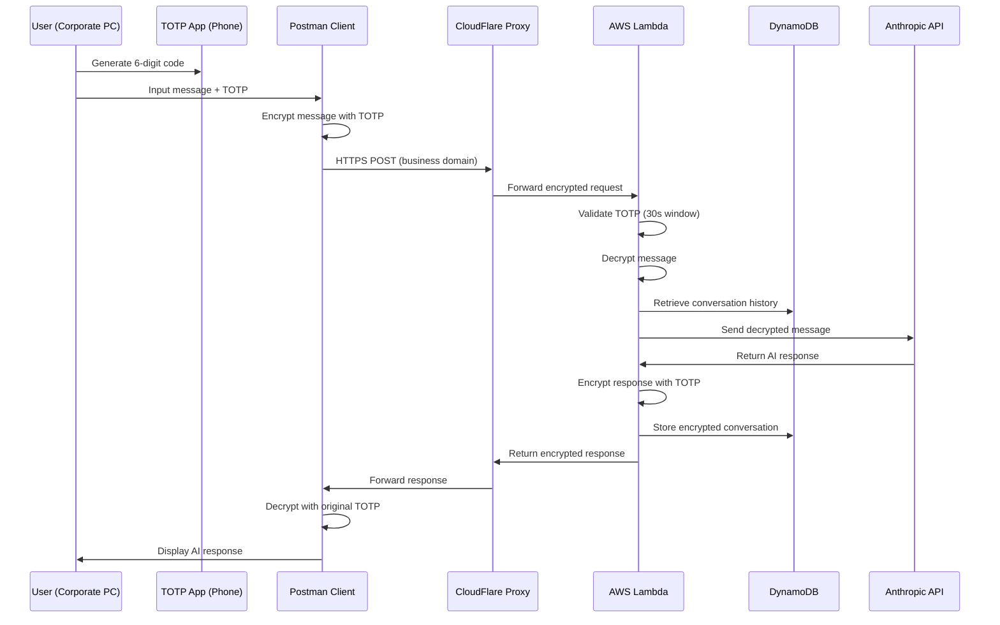

# Solution Architecture Documentation

## Overview

The Secure AI Chat Proxy is a multi-layered security architecture designed to provide undetectable access to AI services through corporate networks while maintaining military-grade encryption and operational security.

## System Architecture

### 1. Core Components

```
┌─────────────────────────────────────────────────────────────────┐
│                        Corporate Network                        │
│  ┌─────────────┐  ┌─────────────┐  ┌─────────────────────────┐  │
│  │   Postman   │  │    TOTP     │  │    Corporate Firewall   │  │
│  │   Client    │  │  Generator  │  │      & Monitoring       │  │
│  │             │  │ (Phone App) │  │                         │  │
│  └─────────────┘  └─────────────┘  └─────────────────────────┘  │
│         │                │                        │             │
│         └────────────────┼────────────────────────┘             │
│                          │                                      │
└──────────────────────────┼──────────────────────────────────────┘
                           │ Encrypted HTTPS Traffic
                           │ to Business Domains
┌──────────────────────────▼──────────────────────────────────────┐
│                    Public Cloud Layer                           │
│  ┌─────────────────────────────────────────────────────────────┐ │
│  │                   CloudFlare Proxy                         │ │
│  │  ┌───────────────┐ ┌───────────────┐ ┌─────────────────┐   │ │
│  │  │api.consulting-│ │webhook.project│ │analytics.perf-  │   │ │
│  │  │metrics.com    │ │sync.net       │ │data.org         │   │ │
│  │  └───────────────┘ └───────────────┘ └─────────────────┘   │ │
│  └─────────────────────────────────────────────────────────────┘ │
│                           │                                      │
│  ┌─────────────────────────▼─────────────────────────────────────┐ │
│  │                   AWS Infrastructure                         │ │
│  │  ┌─────────────┐  ┌─────────────┐  ┌─────────────────────┐   │ │
│  │  │API Gateway  │  │   Lambda    │  │      DynamoDB       │   │ │
│  │  │   (REST)    │  │  Function   │  │   (Conversations)   │   │ │
│  │  └─────────────┘  └─────────────┘  └─────────────────────┘   │ │
│  └─────────────────────────────────────────────────────────────┘ │
│                           │                                      │
└───────────────────────────┼──────────────────────────────────────┘
                           │ Standard HTTPS API Calls
┌──────────────────────────▼──────────────────────────────────────┐
│                     AI Service Layer                            │
│  ┌─────────────────────────────────────────────────────────────┐ │
│  │                   Anthropic Claude API                     │ │
│  │              (Receives Decrypted Messages)                 │ │
│  └─────────────────────────────────────────────────────────────┘ │
└─────────────────────────────────────────────────────────────────┘
```

### 2. Data Flow Architecture



### 3. Security Architecture Layers

#### Layer 1: Network Obfuscation

```
Business Domain Strategy:
├── api.consulting-metrics.com      (Analytics API simulation)
├── webhook.project-sync.net        (Project management webhook)
├── sync.document-workflow.com      (Document management)
└── analytics.performance-data.org  (BI reporting)

CloudFlare Features:
├── SSL/TLS Termination
├── DDoS Protection
├── Geographic Load Balancing
├── Bot Management
└── Analytics Obfuscation
```

#### Layer 2: Transport Security

```
TLS 1.3 Configuration:
├── Perfect Forward Secrecy
├── Zero Round Trip Time (0-RTT)
├── Certificate Transparency
└── HSTS Headers

Request Obfuscation:
├── Random padding (0-1000 bytes)
├── Business-like headers
├── Timing randomization (±30s)
└── Size variation patterns
```

#### Layer 3: Application Encryption

```
AES-256-GCM Configuration:
├── 256-bit symmetric keys
├── 96-bit initialization vectors
├── 128-bit authentication tags
└── Associated authenticated data

Key Derivation (PBKDF2):
├── 100,000 iterations
├── SHA-256 hash function
├── 16-byte random salt per message
└── 32-byte derived key output
```

#### Layer 4: Authentication & Authorization

```
TOTP Implementation (RFC 6238):
├── 30-second time steps
├── 6-digit decimal codes
├── HMAC-SHA1 algorithm
├── ±1 time window tolerance
└── Base32 secret encoding

Validation Logic:
├── Current time step validation
├── Previous time step (clock skew)
├── Next time step (future tolerance)
└── Replay attack prevention
```

## Component Details

### 1. Postman Client Architecture

```javascript
// Client-side encryption flow
Pre-Request Script:
├── Generate current TOTP code
├── Derive encryption key from TOTP
├── Generate random IV and salt
├── Encrypt message payload
├── Add random padding
└── Set request variables

Post-Response Script:
├── Extract encrypted response
├── Retrieve original TOTP used
├── Derive decryption key
├── Decrypt response payload
├── Display to user
└── Store in variables
```

### 2. AWS Lambda Architecture

```javascript
// Lambda function architecture
Handler Entry Point:
├── Request validation
├── CORS handling
├── Action routing (chat/history)
└── Error handling

Chat Processing:
├── TOTP validation (±30s window)
├── Message decryption
├── History retrieval & decryption
├── Anthropic API call
├── Response encryption
├── DynamoDB storage
└── Response formatting

Services Layer:
├── Encryption service (AES-256-GCM)
├── TOTP service (RFC 6238)
├── Storage service (DynamoDB)
├── Anthropic client service
└── Logging service
```

### 3. DynamoDB Data Model

```json
{
  "TableName": "encrypted-chat-sessions",
  "Schema": {
    "PartitionKey": "sessionId (String)",
    "SortKey": "timestamp (String)",
    "Attributes": {
      "role": "user|assistant",
      "content": "ENCRYPTED:hex_data:iv_hex",
      "ttl": "unix_timestamp"
    }
  },
  "Indexes": {
    "TTL": "Automatic cleanup after 30 days",
    "Query Patterns": [
      "Get all messages for session (ordered by time)",
      "Get recent messages for session (limit query)"
    ]
  }
}
```

### 4. Domain Management Architecture

```yaml
Domain Rotation Strategy:
  Primary Domain:
    - Active for 4 weeks
    - All traffic routed here
    - Health monitoring enabled

  Backup Domains:
    - 3-4 domains ready for failover
    - DNS pre-configured
    - SSL certificates maintained

  Emergency Domains:
    - Fresh domains for burn scenarios
    - Rapid deployment capability
    - Independent DNS providers

  Sunset Domains:
    - Gradually reduce traffic
    - Monitor for detection
    - Eventual decommission
```

## Deployment Architecture

### 1. Multi-Region Deployment

```
Primary Region (us-east-1):
├── Lambda Function (main)
├── DynamoDB Table (main)
├── API Gateway (primary)
└── CloudWatch Logs

Backup Region (us-west-2):
├── Lambda Function (replica)
├── DynamoDB Global Table
├── API Gateway (backup)
└── Cross-region replication

Disaster Recovery:
├── Automated failover
├── Data synchronization
├── Health check monitoring
└── DNS failover (Route 53)
```

### 2. Infrastructure as Code Architecture

```yaml
Terraform Structure:
├── modules/
│   ├── lambda/
│   │   ├── function.tf (Lambda configuration)
│   │   ├── iam.tf (IAM roles and policies)
│   │   └── variables.tf (Input parameters)
│   ├── dynamodb/
│   │   ├── table.tf (DynamoDB configuration)
│   │   ├── ttl.tf (Time-to-live settings)
│   │   └── global-tables.tf (Multi-region)
│   ├── api-gateway/
│   │   ├── gateway.tf (API Gateway setup)
│   │   ├── resources.tf (API resources)
│   │   ├── methods.tf (HTTP methods)
│   │   └── deployment.tf (Stage deployment)
│   └── monitoring/
│       ├── cloudwatch.tf (Logs and metrics)
│       ├── alarms.tf (CloudWatch alarms)
│       └── dashboards.tf (Monitoring dashboards)

Environment Management:
├── environments/
│   ├── development/
│   │   ├── main.tf
│   │   ├── variables.tfvars
│   │   └── terraform.tfstate
│   ├── staging/
│   │   ├── main.tf
│   │   ├── variables.tfvars
│   │   └── terraform.tfstate
│   └── production/
│       ├── main.tf
│       ├── variables.tfvars
│       └── terraform.tfstate.backup
```

### 3. CI/CD Pipeline Architecture

```yaml
GitHub Actions Workflow:
├── Code Quality:
│   ├── ESLint (JavaScript linting)
│   ├── Prettier (Code formatting)
│   ├── Security scanning (npm audit)
│   └── Unit tests (Jest framework)
├── Build Process:
│   ├── Webpack bundling
│   ├── Dependency optimization
│   ├── Environment variable injection
│   └── Artifact creation
├── Deployment Stages:
│   ├── Development (auto-deploy)
│   ├── Staging (manual approval)
│   ├── Production (manual approval)
│   └── Rollback procedures
└── Post-Deployment:
    ├── Health checks
    ├── Integration tests
    ├── Performance monitoring
    └── Security validation
```

## Security Model Deep Dive

### 1. Threat Modeling

```
Corporate Network Threats:
├── Deep Packet Inspection (DPI)
│   ├── Mitigation: End-to-end encryption
│   ├── Obfuscation: Business-like traffic
│   └── Evasion: Domain rotation
├── Traffic Analysis
│   ├── Mitigation: Timing randomization
│   ├── Obfuscation: Size variation
│   └── Evasion: Legitimate traffic mixing
├── Domain Reputation Checking
│   ├── Mitigation: Business domain names
│   ├── Obfuscation: Aged domain registration
│   └── Evasion: Domain cycling
└── Behavioral Analysis
    ├── Mitigation: Business hours operation
    ├── Obfuscation: Irregular patterns
    └── Evasion: Multiple user simulation
```

### 2. Cryptographic Architecture

```
Encryption Pipeline:
┌─────────────────┐    ┌─────────────────┐    ┌─────────────────┐
│   Plaintext     │───▶│  TOTP Key       │───▶│   PBKDF2        │
│   Message       │    │  Derivation     │    │   (100k iter)   │
└─────────────────┘    └─────────────────┘    └─────────────────┘
                                                        │
                                                        ▼
┌─────────────────┐    ┌─────────────────┐    ┌─────────────────┐
│   Encrypted     │◀───│  AES-256-GCM    │◀───│   256-bit Key   │
│   Ciphertext    │    │   Encryption    │    │                 │
└─────────────────┘    └─────────────────┘    └─────────────────┘
                                │
                                ▼
                       ┌─────────────────┐
                       │   Auth Tag +    │
                       │   IV + Salt     │
                       └─────────────────┘
```

### 3. Key Management Architecture

```
TOTP Secret Management:
├── Generation:
│   ├── Cryptographically secure random
│   ├── 160-bit entropy minimum
│   ├── Base32 encoding
│   └── QR code generation
├── Distribution:
│   ├── Secure out-of-band delivery
│   ├── Split across multiple channels
│   ├── Time-limited access
│   └── Verification procedures
├── Storage:
│   ├── Phone: Encrypted local storage
│   ├── Lambda: Environment variables
│   ├── Backup: Encrypted offline storage
│   └── Recovery: Multi-factor procedures
└── Rotation:
    ├── Scheduled rotation (monthly)
    ├── Emergency rotation (compromise)
    ├── Gradual migration procedures
    └── Backward compatibility windows
```

## Performance Architecture

### 1. Latency Optimization

```
Request Processing Pipeline:
├── Client-side (0-50ms):
│   ├── TOTP generation: ~5ms
│   ├── Encryption: ~10ms
│   ├── Request formatting: ~5ms
│   └── Network initiation: ~30ms
├── Network Transit (50-200ms):
│   ├── Corporate firewall: ~20ms
│   ├── Internet routing: ~50ms
│   ├── CloudFlare proxy: ~30ms
│   └── AWS API Gateway: ~100ms
├── Lambda Processing (100-2000ms):
│   ├── Cold start: ~500ms (rare)
│   ├── TOTP validation: ~5ms
│   ├── Decryption: ~10ms
│   ├── DynamoDB query: ~20ms
│   ├── Anthropic API: ~1000ms
│   ├── Encryption: ~10ms
│   └── DynamoDB write: ~20ms
└── Response Transit (50-200ms):
    └── Reverse path timing
```

### 2. Scalability Architecture

```
Auto-Scaling Configuration:
├── Lambda Concurrency:
│   ├── Reserved concurrency: 100
│   ├── Provisioned concurrency: 10
│   ├── Cold start mitigation
│   └── Regional distribution
├── DynamoDB Scaling:
│   ├── On-demand billing mode
│   ├── Auto-scaling policies
│   ├── Read/write capacity management
│   └── Global secondary indexes
├── API Gateway Throttling:
│   ├── Rate limiting: 1000 req/sec
│   ├── Burst capacity: 2000 req
│   ├── Per-client throttling
│   └── Regional failover
└── CloudFlare Scaling:
    ├── Global CDN distribution
    ├── DDoS protection
    ├── Traffic spike handling
    └── Geographic load balancing
```

### 3. Caching Strategy

```
Multi-Layer Caching:
├── Client-side (Postman):
│   ├── TOTP generation caching (30s)
│   ├── Encryption key derivation cache
│   ├── Session data caching
│   └── Response history cache
├── CloudFlare Edge:
│   ├── Static content caching
│   ├── API response caching (disabled)
│   ├── DNS resolution caching
│   └── SSL session caching
├── Lambda Memory:
│   ├── Connection pooling
│   ├── Encryption context reuse
│   ├── TOTP validation cache
│   └── Configuration caching
└── DynamoDB:
    ├── DAX caching layer (optional)
    ├── Connection pooling
    ├── Query result caching
    └── Write-through caching
```

## Monitoring Architecture

### 1. Observability Stack

```
Logging Architecture:
├── Application Logs:
│   ├── Lambda function logs
│   ├── API Gateway access logs
│   ├── DynamoDB operation logs
│   └── Client-side error logs
├── Security Logs:
│   ├── TOTP validation events
│   ├── Failed authentication attempts
│   ├── Unusual traffic patterns
│   └── Domain health status
├── Performance Logs:
│   ├── Request/response latency
│   ├── Encryption/decryption timing
│   ├── Database query performance
│   └── Error rates and types
└── Business Logs:
    ├── Usage patterns
    ├── Feature utilization
    ├── Cost optimization data
    └── Capacity planning metrics
```

### 2. Alerting Architecture

```
Alert Severity Levels:
├── CRITICAL (Immediate Response):
│   ├── Service unavailability
│   ├── Security breach indicators
│   ├── Data corruption detected
│   └── Mass TOTP validation failures
├── WARNING (30min Response):
│   ├── Performance degradation
│   ├── Increased error rates
│   ├── Domain reputation issues
│   └── Capacity threshold breaches
├── INFO (Daily Review):
│   ├── Usage pattern changes
│   ├── Cost anomalies
│   ├── Scheduled maintenance
│   └── Performance improvements
└── DEBUG (Development Only):
    ├── Detailed execution traces
    ├── Variable state changes
    ├── Timing measurements
    └── Security event details
```

## Disaster Recovery Architecture

### 1. Backup Strategy

```
Data Backup Tiers:
├── Real-time Replication:
│   ├── DynamoDB Global Tables
│   ├── Cross-region data sync
│   ├── Automatic failover
│   └── Consistency monitoring
├── Daily Backups:
│   ├── Point-in-time recovery
│   ├── Cross-region storage
│   ├── Encryption at rest
│   └── Retention policy (30 days)
├── Weekly Archives:
│   ├── Long-term storage (S3 Glacier)
│   ├── Compliance retention
│   ├── Disaster recovery testing
│   └── Data integrity verification
└── Emergency Procedures:
    ├── Rapid deployment scripts
    ├── Configuration restoration
    ├── Domain switching protocols
    └── Communication procedures
```

### 2. Business Continuity

```
Failure Scenarios & Responses:
├── Single Domain Blocked:
│   ├── Automatic DNS failover
│   ├── Traffic rerouting
│   ├── Client reconfiguration
│   └── Root cause analysis
├── AWS Region Failure:
│   ├── Cross-region failover
│   ├── Data consistency checks
│   ├── Performance monitoring
│   └── Gradual traffic migration
├── Complete Service Compromise:
│   ├── Emergency shutdown procedures
│   ├── Forensic data collection
│   ├── Clean environment rebuild
│   └── Security hardening updates
└── Corporate Detection:
    ├── Immediate service suspension
    ├── Evidence cleanup procedures
    ├── Alternative solution deployment
    └── Lessons learned integration
```

This comprehensive architecture documentation provides the foundation for understanding, implementing, and maintaining the secure AI chat proxy system while ensuring military-grade security and enterprise-level operational excellence.
